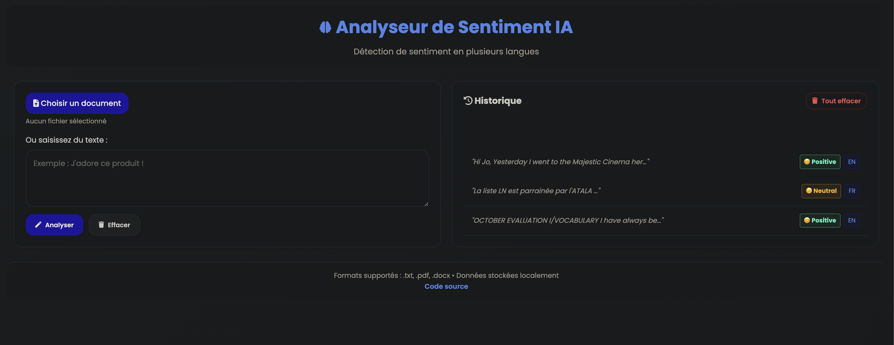

# 🌍 Sentiment Analysis Web App


Welcome to the **Sentiment Analysis Web App**! This application analyzes the sentiment of any text using **OpenAI’s GPT-3.5 Turbo**, detects its language automatically, and stores all analyses in a persistent local history file (`history.json`). Built with **Flask**, it offers a clean, responsive interface for real-time sentiment insights in **dozens of languages**.

> ⚠️ **Note**: This app uses the **OpenAI API** — you need a valid API key to run it.

---

## 🌟 Features

- **AI-Powered Sentiment Analysis** via **OpenAI API** (`gpt-3.5-turbo-1106` in JSON mode).
- **Automatic Language Detection** using `langdetect`.
- **Persistent History**: All analyses are saved to `history.json` (server-side, shared across users).
- **Clear & Modern UI** with emoji-based sentiment feedback.
- **One-Click History Clear** (with user confirmation).
- **Responsive Design**: Works on desktop, tablet, and mobile.
- **Local Execution**: Runs on your machine; only OpenAI calls require internet.

---

## 🛠️ Technologies Used

- **Backend**: Python, Flask
- **AI/NLP**: OpenAI API, `langdetect`
- **Frontend**: HTML5, CSS3, Vanilla JavaScript, Font Awesome
- **Persistence**: JSON file (`history.json`)
- **Environment**: `python-dotenv` (for `OPENAI_API_KEY`)

---

## 📦 Installation

1. **Clone the repository**:
   ```bash
   git clone https://github.com/LOUGBEGNON/sentiment_analysis.git
   cd sentiment_analysis


2. **Install dependencies**:

   Make sure you have Python, pip installed and virtual env created. Then run:

   ```bash
   pip install -r requirements.txt
   ```

3. **Set up your OpenAI API key**:

   Create a .env file at the root of the project
   ```env
   OPENAI_API_KEY=sk-xxxxxxxxxxxxxxxxxxxxxxxxxxxxxxxxxxxxxxxx
   ```
   🔐 Get your key from [OpenAI Platform](https://platform.openai.com/api-keys) .


4. **Run the application**:

   Start the Flask server with:

   ```bash
   python app.py
   ```

   The app will run on `http://127.0.0.1:5001/`.

## Usage

1. Open your web browser and navigate to `http://127.0.0.1:5001/`.
2. Enter the text you want to analyze in the input field.
3. Click the "Analyze Sentiment" button (or press Ctrl+Enter).
4. View the sentiment results displayed on the screen.

## Contributing

We welcome contributions! If you want to help improve the app, please follow these steps:

1. Fork the repository.
2. Create a new branch (`git checkout -b feature-branch`).
3. Make your changes.
4. Commit your changes (`git commit -m 'Add new feature'`).
5. Push to the branch (`git push origin feature-branch`).
6. Open a pull request.

## License

This project is licensed under the MIT License. See the [LICENSE](LICENSE) file for details.

## Contact

For any inquiries, please reach out to the project maintainer:

- **Name**: Amedee LOUGBEGNON
- **Email**: your.email@example.com
- **GitHub**: [LOUGBEGNON](https://github.com/LOUGBEGNON)


## Screenshots


*Home Page of the Sentiment Analysis Web App*


Thank you for checking out the **Sentiment Analysis Web App**! We hope you find it useful for your sentiment analysis needs.